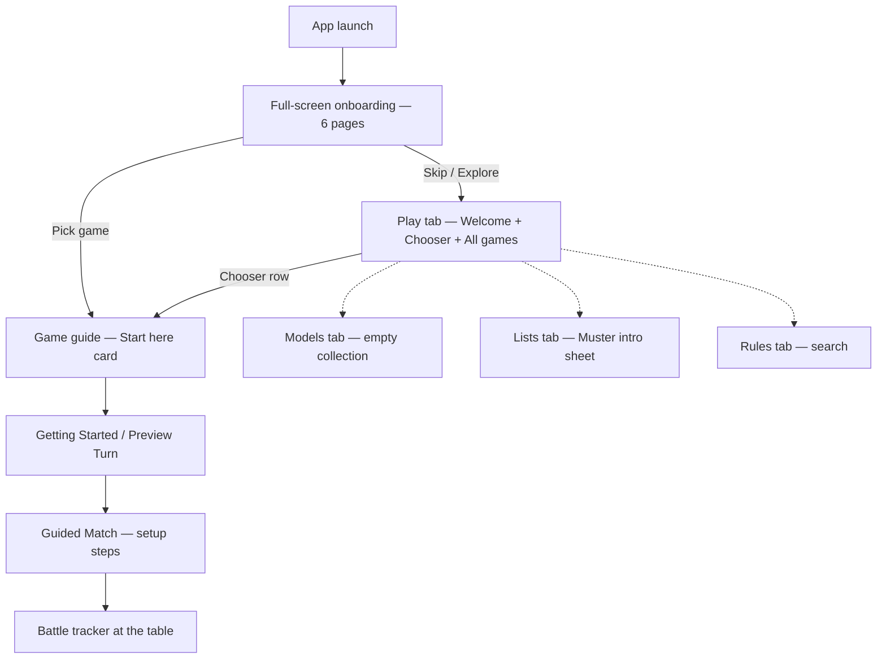

# New Player First Launch Plan

**Status:** Largely implemented via [NewPlayerTwentyRoundPlan.md](NewPlayerTwentyRoundPlan.md) (rounds 1–20, June 2026)  
**Audience:** Someone who has **never played a wargame** — every question answerable inside Tabletome, no Google, no rulebook hunt.  
**Related:** [NewPlayerUXAudit.md](NewPlayerUXAudit.md) (June 2026 audit + shipped checklist) · [UnifiedAppPlan.md](UnifiedAppPlan.md)

## Goal

Reduce cognitive load before the first battle. The spine (onboarding → Play chooser → game guide → Guided Match → battle tracker) is solid; this plan targets **repetition, tab overload, and hobby jargon** that still sends curious beginners sideways.

---

## Current journey (baseline)

**Default landing:** Play tab selected under the onboarding cover (correct).  
**Physical loop:** User moves models and rolls dice at the table; Tabletome tracks phases, score, and rules.

---

## What already works (preserve)

Do not regress these — they ship from the [NewPlayerUXAudit](NewPlayerUXAudit.md) polish pass:

- Plain-language onboarding and Play chooser (“Good first game”, box-based prompts)
- `HomeWelcomeCard` + `HomeNewPlayerChooserCard` on Play
- Per-game **Start here** cards with numbered paths, `WhatYouNeedCard`, glossary chips
- Models / Lists marked **optional** in onboarding, chooser footer, and empty states
- `ActiveGameContextStore` syncing Play → Rules Search
- Settings **New here?** section with tour replay + Combat Patrol / Spearhead quick links
- Guided Match: **Use Starter Matchup**, recommended defaults, named setup checklist
- Tab labels: Models (Bench), Lists (Muster), Play, Rules Search

---

## Gaps — where a total beginner still struggles

### G1 — Onboarding front-loads concepts before value

Six screens before any action. Pages 2–5 repeat ideas (offline, tabs, rules, guides) visible again on Play.

**Beginner feeling:** “Is this an app or a slideshow? I just want to know if this works with my box.”

**Missing:** A single sentence on what a wargame *is* — move miniatures, roll dice, score objectives, ~60–90 min, two players.

### G2 — Three game pickers in a row

Game options appear on:

1. Onboarding page 2 (preview cards)
2. Onboarding page 6 (four full-width buttons)
3. Play tab chooser + “All games” list

**Beginner feeling:** “I already picked — why am I choosing again?”

### G3 — Five tabs on day one

Models, Lists, Play, Rules, Settings — even with “optional” copy, empty Collection / Lists feels like failure.

**Beginner feeling:** “Did I do something wrong? No armies yet — is the app broken?”

### G4 — “Explore the app” has no single next tap

Lands on Play with welcome + chooser + list. Nothing highlights the one row to tap.

**Beginner feeling:** “Okay… now what?”

### G5 — Jargon still leaks at stress points

| Moment | Still confusing |
|--------|-----------------|
| Box doesn’t say “Combat Patrol” or “Spearhead” | Chooser assumes GW product names on the cover |
| 40k guide | Two entries + “11th Edition” + Combat Patrol cross-link |
| Guided Match | Enhancements, Secondary, Patrol, Datasheet |
| What You Need (Spearhead) | realm battlefield pack, twist decks, battle tactic deck |
| Preview a Turn | Command phase, objectives, battle round without a 10-second primer |

### G6 — Rules vs Play vs Guide — three doors

- Play → game guide → Getting Started
- Play → game guide → Rules Reference link
- Rules tab → search

**Beginner feeling:** “Where do I look up what charging means?”

### G7 — Path inconsistency between games

- **Spearhead:** Preview Turn → Getting Started → Guided Match
- **Combat Patrol:** Getting Started → Missions → Preview Turn → Guided Match

Both are defensible; switching games feels like the app changed its mind.

### G8 — Muster intro interrupts the wrong moment

`MusterIntroSheet` on first Lists visit after onboarding — wrong if they tapped Lists by accident on day one.

### G9 — No “first game completed” milestone

No celebration after setup or round 1. No signal to revisit Models / Lists later.

---

## Natural beginner questions (must stay answerable in-app)

1. What game do I have / which option do I pick?
2. What do I need physically? (dice, board, time)
3. What’s the first thing I should tap?
4. What’s a phase / turn / battle round?
5. What’s an Enhancement / Secondary / stratagem / VP?
6. Why does Rules Search show a different game?
7. What are Models and Lists — do I need them today?
8. Where is the mission / deployment map?
9. When do we roll dice and move models?
10. Is this the right edition for my box?

---

## Design principles

| Principle | Application |
|-----------|-------------|
| **One obvious next step** | Every screen after onboarding has exactly one primary CTA |
| **Speak in possessions, not product lines** | “Box on my shelf” > “Spearhead” |
| **Defer hobby tooling** | Models / Lists are rewards after first game, not day-one tabs |
| **Explain the physical loop early** | “You move models and roll dice; the phone tracks score and rules” — repeat once in onboarding page 1 |
| **Never ask them to open a book** | Guard all new copy; inline rules in app |

---

## Recommended work (prioritized)

### P0 — Highest impact, smallest leap

#### P0.1 Post-onboarding continuation state

Persist `onboardingChoice` (game system id or `undecided`). Adapt Play tab:

- **Undecided** → chooser prominent; collapse “All games” behind “More games”
- **Chose game** → “Continue your path” card; chooser collapsed; deep-link CTA to next step on game guide

**Touches:** `OnboardingStore` / new `FirstSessionStore`, `HomeView`, `HomeWelcomeCard` or new `HomeContinueCard`

#### P0.2 Shorten onboarding to 3 screens

Merge redundant pages:

1. **What Tabletome is** — one paragraph + “you roll real dice” + optional wargame-in-one-sentence
2. **Pick your box** — merge current pages 2 + 6 (chooser UI, not duplicate preview + buttons)
3. **About the tabs** — expandable / “Show me the tabs” instead of mandatory pages 3–5

Keep: Skip, Pick my game now (jump to screen 2), Explore the app.

**Touches:** `OnboardingContent`, `OnboardingView`

#### P0.3 “I don’t know what I have” helper

Lightweight branch — not photo ML on day one:

- Fantasy vs sci-fi
- Small starter box vs bigger army
- Cover says “Combat Patrol” Y/N (40k) or “Spearhead” Y/N (AoS)

Result: 1–2 recommended chooser rows with plain copy.

**Touches:** new `BoxIdentificationSheet`, `HomeNewPlayerChooserCard`, onboarding finale

---

### P1 — Smooth path to first battle

#### P1.1 Unified starter path template

Standardize narrative across Spearhead, Combat Patrol, SC:TMG:

**What you need → How a turn works (preview) → Setup at the table (Guided Match)**

Combat Patrol missions become a sub-step inside Guided Match (or linked from setup step), not a separate numbered step before preview.

**Touches:** `NewPlayerStartHereCard`, `CombatPatrolStartHereCard`, `ScStartHereCard`, `GettingStartedView`

#### P1.2 Rules Search as in-flow escape hatch (session 1)

- **Look this up** on Guided Match steps and Preview Turn → Rules Search pre-filled with term + active game
- Rules tab footer for users who haven’t opened a guide: *“Tip: most beginners start on Play, not here.”*
- Consider de-emphasizing Rules tab until first guide open (badge / copy only — tab stays reachable)

**Touches:** `MatchStepDetailView`, sample turn walkthroughs, `AppSearchView`, `RulesReferenceView`

#### P1.3 Defer hobby pillar intros

- `MusterIntroSheet` → second visit to Lists, or after `hasOpenedGameGuide`
- Collection “Load sample data” — same gate or softer “Explore later” placement

**Touches:** `MusterTab`, `CollectionHomeView`, `FirstSessionStore`

---

### P2 — Polish and confidence

#### P2.1 Glossary on first touch

Extend `GlossaryChipsRow` pattern to inline tappable terms in What You Need, Preview Turn, setup steps → bottom sheet definition.

#### P2.2 Softer Guided Match first screen

Lead with **Use Starter Matchup** as the only obvious button; army picking under **We brought our own lists**.

#### P2.3 First-session tab bar emphasis

Play visually primary (badge on tab or subtle “Start here”) until `hasCompletedFirstSetupStep` or first guide open.

Gate behind `ReleaseSurface` or `FirstSessionStore` — do not hide tabs in production without flag.

#### P2.4 Hide Match History until relevant

Toolbar History link on Play only when `MatchHistory` has ≥1 entry (or user expands “More”).

#### P2.5 First-game milestone

After battle tracker round 1 or setup complete:

*“Nice — you’re playing. Track these models under Models?”* with soft cross-link.

**Touches:** `BattlePhaseTrackerView`, `NewPlayerTipsStore` or `FirstSessionStore`

---

## Implementation checklist

### P0
- [x] `FirstSessionStore` — persist onboarding choice, guide opened, first setup step, first battle round
- [x] Play tab continuation UI (`HomeContinueCard` or adaptive `HomeWelcomeCard`)
- [x] Onboarding reduced to 3 screens + expandable tab tour
- [x] `BoxIdentificationSheet` — “don’t know what you have” branch

### P1
- [x] Unified starter path (What you need → Preview → Guided Match) for Spearhead, Combat Patrol, SC:TMG
- [x] In-flow Rules Search links from Guided Match + Preview Turn
- [x] Defer `MusterIntroSheet` and soften Collection sample-data prompt

### P2
- [ ] Inline glossary tap → bottom sheet
- [x] Guided Match first-screen hierarchy (Starter Matchup primary)
- [ ] First-session Play tab emphasis
- [x] Conditional Match History toolbar
- [x] Post-round-1 milestone + Models cross-link

### Verification (fresh install, iPhone + iPad)
- [x] Undecided user sees one obvious next step on Play after onboarding
- [x] Game-picked user lands on guide step 1 without re-choosing
- [x] Lists tab does not show Muster intro on first accidental tap
- [x] Rules Search opens from Preview Turn with correct game + query
- [x] All 10 beginner questions answerable without leaving app

---

## Out of scope (for this plan)

- Photo-based box identification
- Hiding Bench / Muster tabs entirely in release (progressive disclosure uses emphasis + copy, not removal)
- Monetization / account gates
- Play engine architecture refactor (see [PlayEngineArchitectureRefactor.md](PlayEngineArchitectureRefactor.md))

---

## Success metrics (qualitative)

- Time from first launch to Guided Match army selection ↓
- Fewer Support / beta notes: “which 40k?”, “empty armies”, “wrong rules game”
- First-session users complete Preview Turn or Guided Match setup without visiting Models / Lists

---

## Bottom line

The spine works for a motivated beginner with a labeled starter box. Remaining work is **less tour, less repetition, clearer next tap** — not more cards on Play. Ship P0 first; P1 aligns game paths; P2 adds confidence after the first battle starts.
