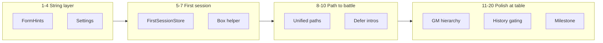

# New Player — Twenty Round Plan

**Status:** Rounds 1–20 complete (June 2026)  
**Related:** [NewPlayerUXAudit.md](NewPlayerUXAudit.md) · [NewPlayerFirstLaunchPlan.md](NewPlayerFirstLaunchPlan.md) · [iPadFreshInstallUXAudit.md](iPadFreshInstallUXAudit.md)

## North star

A total beginner can answer the [10 natural questions](NewPlayerUXAudit.md) without Google. Expert players are not slowed down.

## Round index

| # | Round | Outcome | Status |
|---|--------|---------|--------|
| 1 | FormHints + forms | Shared form footers localized | ✅ |
| 2 | Unit detail + overview | Sample-data exploration polished | ✅ |
| 3 | Banners & undo | System feedback localized | ✅ |
| 4 | Settings & legal | Onboarding escape hatch complete | ✅ |
| 5 | FirstSessionStore | Play shows Continue, not re-pick | ✅ |
| 6 | 3-screen onboarding | Faster first launch | ✅ |
| 7 | Box helper | “What box do I have?” branch | ✅ |
| 8 | Unified starter paths | Same 3-step story all games | ✅ |
| 9 | Rules in-flow | Look-up from guide/match | ✅ |
| 10 | Defer hobby intros | Lists/Models less punishing | ✅ |
| 11 | GM first screen | Starter Matchup primary | ✅ |
| 12 | CP preview turn | Plain-language walkthrough | ✅ |
| 13 | 40k phase coach | Game-scoped tips | ✅ |
| 14 | Tracker terminology | Plain unit rules language | ✅ |
| 15 | VoiceOver pass | GM + splits labeled | ✅ |
| 16 | Dynamic Type | No clipped CTAs | ✅ |
| 17 | Lists ↔ Models | Ownership loop clear | ✅ |
| 18 | History gating | Hidden until relevant | ✅ |
| 19 | First-game milestone | Post-setup nudge | ✅ |
| 20 | Verification matrix | Audits closed | ✅ |

## Phases

## Out of scope (round 21+)

Photo box ID, hiding tabs, play engine refactor, full `.xcstrings` translation, Muster↔Play catalog crosswalk.

## Success after round 20

Fresh install → ≤3 onboarding screens → one obvious Play CTA → Rules look-up from setup → optional Models nudge after first game → Match History only after a saved match.
