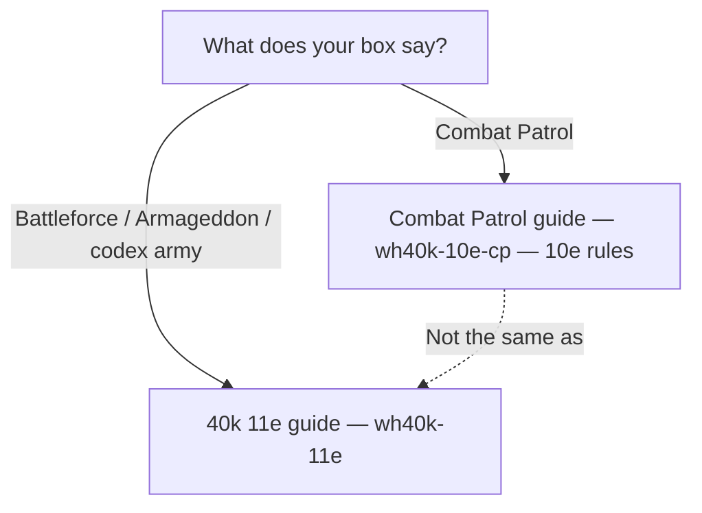

# Tabletome — game mode product scope

**Last updated:** 2026-06-26

This is the intended support matrix for play modes. **Edition** and **format** are different axes — Combat Patrol is a **10th Edition format**, not “40k lite 11e.”

---

## Supported / planned

| Franchise | Mode | `GameSystemId` | Rules | Release today |
|-----------|------|----------------|-------|---------------|
| **Age of Sigmar** | Spearhead | `aos-spearhead` | AoS 4e Spearhead (starter boxes) | ✅ Shipped |
| **Age of Sigmar** | Full / standard | — (future) | Battletomes, matched play | 📋 Planned |
| **Warhammer 40,000** | Full 11th Edition | `wh40k-11e` | 11e core — Armageddon, Battleforces, matched play | ✅ Shipped |
| **Warhammer 40,000** | Combat Patrol | `wh40k-10e-cp` | **10th Edition** patrol format (box-set missions) | ✅ Shipped |
| **StarCraft** | The Miniatures Game | `sc-tmg` | SC TMG Founders Edition | 🔒 Gated (post-1.0) |

---

## Explicitly out of scope (for now)

| Mode | Why |
|------|-----|
| **Full 10th Edition matched play** (`wh40k-10e` stub) | Superseded by 11e for “full 40k.” CP boxes still use **10e patrol rules** via `wh40k-10e-cp` — that is not the same as full 10e list-building. |

Do **not** surface a “Warhammer 40,000 10th Edition” home row. Players with Combat Patrol boxes belong on **Combat Patrol (10th Edition rules)**.

---

## Player routing (40k)

| Box on shelf | Guide | Edition |
|--------------|-------|---------|
| “Combat Patrol” (SM vs Tyranids, etc.) | Combat Patrol | **10th Edition** patrol rules |
| Armageddon, Battleforce, 1,000+ pt lists | Warhammer 40,000 | **11th Edition** |

---

## Implementation notes

- **Separate roll engines:** `Wh40k10eCombatRollEngine` (CP) vs `Wh40k11eCombatRollEngine` (11e). Never merge.
- **Release surface:** [`specs/ReleaseSurfaceSpec.md`](../../specs/ReleaseSurfaceSpec.md) — `wh40k-10e-cp` in release defaults; bare `wh40k-10e` stays hidden.
- **UI copy:** Always pair “Combat Patrol” with “10th Edition” where beginners choose a mode.

## Related docs

- [combat-patrol/README.md](combat-patrol/README.md) — CP mode
- [wh40k-11e/](wh40k-11e/) — 11e launch
- [wh40k-10e/README.md](wh40k-10e/README.md) — full 10e deferred
- [aos-standard/scope.md](aos-standard/scope.md) — AoS full planned
