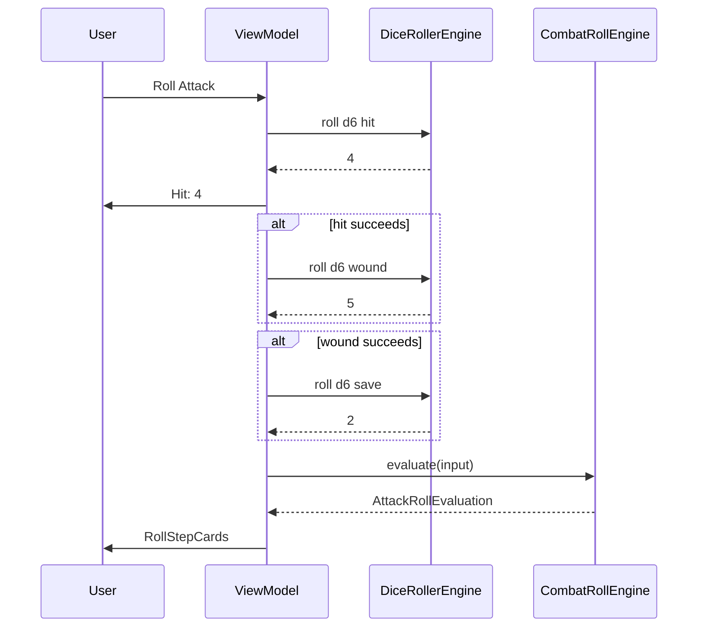

# Dice Roller Spec & Implementation Plan

## Scope

| | **v1 — Roll simulator (ship now)** | **Future — Dice tray (later)** |
|---|-----------------------------------|--------------------------------|
| **Why** | Player has few physical dice; needs fair d6s in combat | Make the app more interactive and fun |
| **What** | Tap to roll; values feed combat resolver; plain-text transparency | Tray, tumble animation, roll log, polyhedral free-roll screen |
| **Feel** | Utility — like a dice button on a calculator | VTT — Roll20 / Fantasy Grounds dice theater |
| **UI weight** | Minimal — buttons + result chips beside existing pickers | Dedicated tray region, animations, sounds |

**v1 is not blocked on animation, tray layout, or standalone dice screens.** Ship the simulator first; dice tray is a separate follow-up spec phase.

---

## Goal (v1)

Help Spearhead players who do not have enough physical dice by simulating rolls inside the combat resolver — **transparent** (what die, what purpose, what result) and **trustworthy** (fair RNG, verified in tests).

Manual entry via `DiceValuePicker` stays available. Simulated mode adds roll buttons that fill in values and then evaluate as today.

---

## Product principles (v1)

1. **Practical first** — One tap to roll a d6 for hit, wound, or save; no spectacle required.
2. **Transparent** — Show die type, purpose, and face value before evaluation runs.
3. **Fair** — Injectable RNG + statistical tests; honest disclosure in Settings.
4. **Optional** — Physical pickers remain; simulated is opt-in per screen.
5. **Integrated** — Rolls feed `CombatRollEngine` unchanged; no parallel combat path.

---

## User stories (v1)

| As a… | I want to… | So that… |
|-------|------------|----------|
| New player without dice | Tap “Roll” next to Hit and get a d6 result | I can play without buying dice |
| Roll Evaluator user | Roll hit → wound → save in order, skipping steps when the attack ends | I mirror real combat without extra dice |
| Multi-attack user | Roll each attack’s dice the same way | I do not run out of d6s mid-sequence |
| Skeptical player | Keep using manual pickers | I use my own dice when I have them |
| Variable-damage user | Roll D3/D6/2D6 when damage applies | Odd dice profiles are covered |

**Deferred (dice tray):** standalone d8/d12 tray, priority-roll theater, fling gestures, roll log export, battle-checklist dice UI.

---

## Dice inventory (v1)

AoS Spearhead combat is **d6-centric**:

| Context | Dice | v1 |
|---------|------|-----|
| Hit / Wound / Save / Ward | D6 | ✅ |
| Variable damage | D3, D6, 2D6 | ✅ when weapon profile requires |
| Priority (round 2+) | D6 | Future (simple roll button OK without tray) |
| Generic d4/d8/d10/d12/d20 | — | Future dice tray only |

**D3:** roll 1d6, divide by 2 rounding up (AoS standard). Show both values: `d6: 5 → D3: 3`.

---

## Current foundation

| Piece | Role |
|-------|------|
| `CombatRollEngine` | Deterministic evaluation — no RNG |
| `DiceValuePicker` | Manual 1–6 segmented control |
| `RollStepCard` | Step outcome + explanation (already cites rolled values) |

Randomness lives in a new Domain service. ViewModels roll → set picker values → call `evaluate()` as today.

---

## Architecture (v1)

### Layer placement

```
Domain/
  Engines/DiceRollerEngine.swift
  Models/DiceRoll.swift                    — DieType, RollPurpose, DiceRollResult
  Protocols/RandomNumberGenerating.swift

Features/CombatRoll/
  …ViewModels                              — roll-then-evaluate orchestration

DesignSystem/
  DiceRollButton.swift                     — icon button + result chip
  DiceInputModePicker.swift                — physical | simulated
```

No tray, animation, or chat-log components in v1.

### Core types

```swift
public enum DieType: Int, Sendable {
    case d3 = 3, d6 = 6  // d3 via d6 mapping; extend in dice-tray future work
}

public enum RollPurpose: Sendable {
    case hit, wound, save, ward, damage
    case variableDamage(WeaponVariableDamage)
}

public struct DiceRollResult: Sendable, Equatable, Identifiable {
    public let id: UUID
    public let dieType: DieType
    public let purpose: RollPurpose
    public let faceValue: Int              // d6 face, or D3 result
    public let underlyingRolls: [Int]      // e.g. [5] for D3, [3,5] for 2D6
}
```

### RNG

| Approach | Use |
|----------|-----|
| `SystemRandomNumberGenerator` | Production |
| `SeededGenerator` | Unit tests |

`Int.random(in: 1...sides, using: &generator)` per die. Inject generator — never call bare `Int.random` in features.

---

## Randomness verification

| Test | Threshold |
|------|-----------|
| Bounds | Every roll ∈ `1...sides` |
| D3 mapping | All six d6 inputs → correct D3 |
| Chi-squared (d6) | p > 0.01 at α=0.01 over 10k+ rolls — slow test suite |

```
Tests/Unit/DiceRollerEngineTests.swift
Tests/Unit/DiceRollerStatisticsTests.swift   — chi-squared, release / slow CI only
```

Settings copy: “Dice use your device’s secure random number generator. For casual play.”

---

## UX (v1): combat-integrated simulator

### Mode toggle

```
[ Physical dice ]  [ Roll in app ]
```

- **Physical:** `DiceValuePicker` — unchanged.
- **Simulated:** each picker row gains a **Roll** button; tapping rolls d6 and sets the picker value. Values remain editable.

Persist `UserDefaults` key `diceInputMode`.

### Roll flow

**Option A — per-field (default v1):** User taps Roll beside Hit, sees `4`, taps Roll beside Wound, etc., then **Evaluate Attack**.

**Option B — roll sequence:** One **Roll Attack** button rolls hit → (if needed) wound → (if needed) save → ward → damage dice, updating fields as it goes. Shows a compact inline summary:

```
Hit d6: 4 · Wound d6: 2 (attack ends)
```

Recommend **Option B** as primary in simulated mode (fewer taps when dice are scarce); keep per-field Roll for corrections.



### Transparency (no tray required)

1. **Before evaluate:** inline summary of simulated values (replace or supplement pickers).
2. **In `RollStepCard`:** explanations already say “Rolled 4 vs Hit 4+” — ensure simulated rolls use the same path.
3. **D3 / 2D6:** show breakdown in damage step: `2d6: 3 + 5 = 8` or `d6: 5 → D3: 3`.
4. No separate roll-log panel in v1 — `RollStepCard` list *is* the audit trail.

### Surfaces (v1)

| Screen | Simulated rolls |
|--------|-----------------|
| `CombatRollEvaluatorView` | ✅ |
| `UnitMatchupEvaluatorView` | ✅ + ward |
| `MultiAttackEvaluatorView` | ✅ per attack |

### Accessibility (v1)

| Control | Identifier |
|---------|------------|
| Mode picker | `diceRoller.inputMode` |
| Roll Hit | `diceRoller.roll.hit` |
| Roll Attack | `diceRoller.roll.attack` |
| Result chip | `diceRoller.result.hit` |

Announce each roll via `AccessibilityNotification.Announcement`: “Hit roll, 4”.

---

## API sketch (v1)

```swift
@MainActor
final class CombatRollEvaluatorViewModel: ObservableObject {
    @Published var diceInputMode: DiceInputMode = .physical
    @Published private(set) var lastRolls: [DiceRollResult] = []
    // hitRoll, woundRoll, saveRoll — unchanged

    private let diceRoller: DiceRolling

    func rollAttack() async {
        lastRolls.removeAll()
        let hit = await roll(.hit)
        hitRoll = hit.faceValue
        guard wouldNeedWoundRoll(hit: hit.faceValue) else {
            evaluate()
            return
        }
        // … wound, save, ward, damage …
        evaluate()
    }

    func rollField(_ purpose: RollPurpose) async { … }
}
```

---

## Implementation phases

### Phase 0 — Domain + tests

- [ ] `DieType`, `RollPurpose`, `DiceRollResult`
- [ ] `RandomNumberGenerating` + `DiceRollerEngine` (d6, D3, 2D6)
- [ ] Unit tests: bounds, D3, seeded, chi-squared (slow)

### Phase 1 — UI primitives

- [ ] `DiceRollButton` (roll icon + result chip)
- [ ] `DiceInputModePicker`
- [ ] Inline roll summary row (optional compact text)

### Phase 2 — Roll Evaluator

- [ ] Simulated mode on `CombatRollEvaluatorView`
- [ ] `rollAttack()` sequence + early termination
- [ ] ViewModel tests

### Phase 3 — Unit Matchup + Multi-attack

- [ ] Same pattern on matchup + multi-attack
- [ ] Ward + variable damage rolls

### Phase 4 — Ship

- [ ] Settings RNG disclosure
- [ ] Update `CombatRollEvaluatorSpec.md`
- [ ] `ReleaseSurface.showsDiceRoller` if gating needed

---

## Future work: Dice tray (interactive)

*Not in v1. Preserved from brainstorming — Roll20 / Fantasy Grounds inspiration for when we want the app to feel more playful.*

### Vision

- **Dice tray** play area where dice tumble and settle
- **Roll log** — chat-style transcript: `Hit · 1d6 → (4) = 4 vs 4+`
- **Standalone tray** — D4–D20 free rolls (d8, d12) without combat context
- **Animation tiers** — 2.5D SwiftUI tumble (v1 of tray), optional SceneKit later
- **Sound / haptics** — optional clatter; off by default
- **Fling gesture**, dice glyphs per type, iPad tray+log columns
- **Priority rolls** on battle checklist with two d6 in tray

### Reference patterns (when we build this)

| Pattern | Roll20 / FG | Future Tabletome |
|---------|-------------|------------------|
| Dice land in play area | 3D tumble in chat/table | `DiceTrayStage` at top of screen |
| Roll log | `/roll 2d6+5 → (4,2) = 11` | `DiceRollLogView` |
| Context labels | Formula + description | Auto from weapon + step |
| Standalone dice | Quick-roll GUI / Dice Window | `PolyhedralDiceTrayView` in Settings |

### Future files (do not create in v1)

`DiceTrayStage`, `DiceGlyphView`, `DiceRollAnimation`, `DiceRollLogView`, `PolyhedralDiceTrayView`, `DiceAnimating` protocol.

### Future phases (after v1 ships)

1. Tray + 2.5D animation on combat screens
2. Roll log panel
3. Standalone polyhedral tray
4. SceneKit / sounds / polish

See git history of this spec for full VTT wireframes and timing tables.

---

## Open questions (v1)

| # | Question | Default |
|---|----------|---------|
| 1 | Default mode on first launch? | **Simulated** for new users without dice story; or Physical to avoid behavior change |
| 2 | Primary action: Roll Attack vs per-field Roll? | **Roll Attack** in simulated mode |
| 3 | Gate behind feature flag? | `showsDiceRoller` until QA passes |

---

## Out of scope (v1)

- Dice tray, animations, roll log UI
- Standalone d8/d12 screen
- SceneKit physics
- Multiplayer / shared rolls
- `/roll` command parser

---

## Related specs

- [CombatRollEvaluatorSpec.md](CombatRollEvaluatorSpec.md)
- [SpearheadHelperRoadmap.md](SpearheadHelperRoadmap.md)
- [ArchitectureSpec.md](ArchitectureSpec.md)
- [TestPlanSpec.md](TestPlanSpec.md)

---

## Verification

| Field | Value |
|-------|-------|
| Target release | v0.3 (roll simulator only) |
| Dice tray | Future — not scheduled |
| Last verified | 2026-06-17 |
| Status | **Plan — not implemented** |
| Code paths (planned) | `Domain/Engines/DiceRollerEngine.swift`, `DesignSystem/DiceRollButton.swift`, `Features/CombatRoll/`, `Tests/Unit/DiceRollerEngineTests.swift` |
