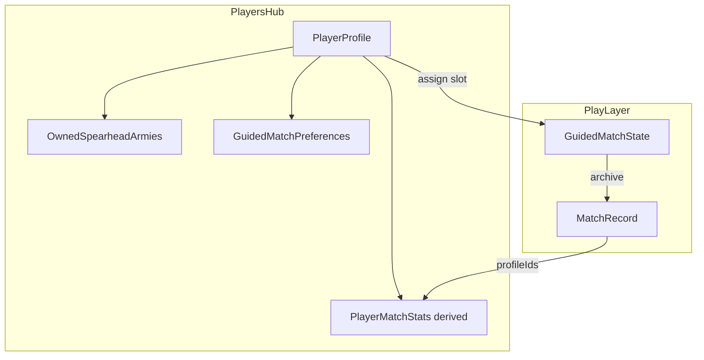
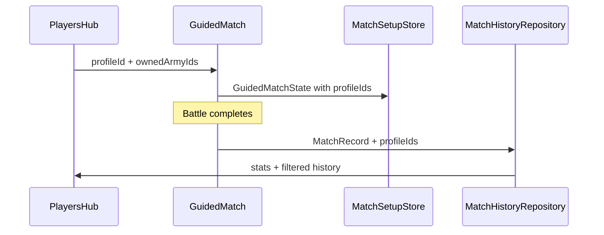

# Players Hub Spec

**Status:** Draft spec (no ship date)  
**Last updated:** 2026-07-01  
**Scope:** Spearhead-first; extensible to other `gameSystemId`s post-1.0  
**Audience:** Jacob + Chris household play; generalizes to 2–8 local players on one device

**Related docs**

- [`ongoing/spearhead-flawless-guided-match-plan.md`](../../ongoing/spearhead-flawless-guided-match-plan.md) — Spearhead GM master plan
- [`MatchHistorySpec.md`](MatchHistorySpec.md) — global history (extended with profile ids)
- [`GuidedMatchSpec.md`](GuidedMatchSpec.md) — army selection and setup flow
- [`FutureIdeas/MatchHistoryAndLog.md`](../../FutureIdeas/MatchHistoryAndLog.md) — per-player win-rate backlog

---

## User story

As Jacob or Chris, I define myself once in **Players**, mark which Spearhead armies I own, review my match history, and set Guided Match preferences — so the next game pre-fills my name and army without retyping, and I can see my record vs Chris.

---

## 1. Problem today

Guided Match treats players as **ephemeral slot labels** inside the active match only:

- Names live on `PlayerArmySelection.playerName` in `GuidedMatchState`, persisted per game system via `MatchSetupStore` (UserDefaults).
- Army ownership is implicit — you pick any catalog army each time; starter box selection is **device-global** (`SpearheadStarterBoxStorage`).
- Match history is **global** with denormalized name strings (`MatchPlayerSummary`); no stable link back to a profile, no per-player filter or stats.
- Coaching / UX prefs are **device-global** (`NewPlayerTipsStore`, `diceInputMode` AppStorage).

Jacob and Chris re-type names, re-pick armies they always use, and cannot see “my games” vs “our games.”

---

## 2. North star

After setup once:

1. Open **Play → Players** (or home card) and see **Jacob** and **Chris** with owned Spearhead armies.
2. Start Guided Match → pick Jacob vs Chris → names and army pickers pre-filter to **armies they own**; defaults apply from saved prefs.
3. Finish a game → history row links to both profiles; each profile shows W/L, recent matchups, and rematch shortcuts.
4. Chris can turn off beginner coaching without resetting Jacob’s tips.

---

## 3. Locked decisions (v1 spec)

| Decision | Choice |
|----------|--------|
| Identity | **Local household profiles** — no accounts, no cloud sync (same posture as `MatchHistorySpec.md`) |
| Storage | JSON in Application Support (mirror Match History pattern) |
| Player count | 2–8 profiles; **2 default placeholders** on first open: Jacob, Chris (editable) |
| Opponent slot | **Guest** always available in Guided Match — free-text name, no profile required |
| Army ownership | Checkbox list from Spearhead catalog (`armyId`); optional link to starter **box set** for quick “I bought Skaventide” |
| History link | Archive stores optional `playerOneProfileId` / `playerTwoProfileId`; legacy records match by normalized name fallback |
| Entry points | **Play tab** (primary) + **Settings → Players** (management + advanced prefs) |
| Release gate | `ReleaseSurface.showsPlayersHub` (off until promoted) |
| Game scope | **Spearhead owned armies + prefs** in v1; other modes add `ownedContent` keys later |

---

## 4. Concepts



| Term | Meaning |
|------|---------|
| **Player profile** | Persistent identity: display name, avatar color, owned armies, GM prefs |
| **Household** | All profiles on this device; optional **default Player 1** profile for “this iPad is Jacob’s” |
| **Owned army** | User marked `armyId` as owned; drives picker filtering and profile army list |
| **Guest** | Unprofiled opponent for one-off games; history stores name only |
| **Player match stats** | Derived from `MatchRecord` where profile id matches (wins, losses, ties, last played) |

---

## 5. Data model (Domain)

New types in `Domain/Models/PlayerProfile.swift`:

```swift
public struct PlayerProfile: Codable, Sendable, Identifiable, Equatable {
    public let id: UUID
    public var displayName: String           // "Jacob", "Chris"
    public var sortOrder: Int
    public var accentColorName: String?      // DesignSystem token, optional
    public var ownedSpearheadArmyIds: Set<String>
    public var linkedStarterBoxIds: Set<String>  // e.g. "skaventide" → auto-add featured armies
    public var guidedMatchPreferences: GuidedMatchPlayerPreferences
    public var createdAt: Date
    public var updatedAt: Date
}

public struct GuidedMatchPlayerPreferences: Codable, Sendable, Equatable {
    public var experienceLevel: PlayerExperienceLevel  // beginner | tableRegular
    public var defaultDiceInputMode: DiceInputMode?    // nil = inherit device default
    public var preferredArmyIdByOpponentArmyId: [String: String]  // optional rematch shortcut
    public var defaultRegimentAbilityByArmyId: [String: String]
    public var defaultEnhancementByArmyId: [String: String]
    public var showExpandedSetupSteps: Bool?         // nil = use global NewPlayerTipsStore
}

public enum PlayerExperienceLevel: String, Codable, Sendable {
    case beginner       // show coaching banners, expanded setup
    case tableRegular   // suppress most NewPlayerTipsStore surfaces for this player
}

public struct HouseholdPlayersState: Codable, Sendable {
    public static let currentSchemaVersion = 1
    public var schemaVersion: Int
    public var profiles: [PlayerProfile]
    public var defaultPlayerOneProfileId: UUID?  // "this device defaults to Jacob"
}
```

### Extend existing match archive (non-breaking)

Add optional fields to `MatchPlayerSummary`:

```swift
public var playerOneProfileId: UUID?
public var playerTwoProfileId: UUID?
```

Bump `MatchRecord.currentSchemaVersion` with decode defaults `nil` for legacy rows.

### Extend active match (optional v1.1)

Add to `PlayerArmySelection`:

```swift
public var profileId: UUID?  // nil = guest / legacy
```

Guided Match copies `displayName` from profile on assign; edits to name in-match do not mutate profile unless user taps **Update profile name**.

---

## 6. Storage and repository

Follow `JSONMatchHistoryRepository` pattern:

| Artifact | Path |
|----------|------|
| Household index | `Application Support/Players/household.json` |
| Migration seed | First launch: create Jacob + Chris profiles with empty owned armies |

```swift
public protocol PlayerProfileRepository: Sendable {
    func loadHousehold() async throws -> HouseholdPlayersState
    func saveHousehold(_ state: HouseholdPlayersState) async throws
    func profile(id: UUID) async throws -> PlayerProfile?
}
```

**Domain use cases:**

- `PlayerProfileStore` — CRUD, reorder, delete (block delete if only profile left)
- `PlayerMatchStatsCalculator` — scan `MatchHistoryRepository` by profile id + name fallback
- `OwnedArmyResolver` — union of explicit `ownedSpearheadArmyIds` + armies from linked starter boxes (`GuidedMatchFeaturedArmies` / box set config)

---

## 7. UI — information architecture

### 7.1 Play tab entry (primary)

**Location:** `HomeView` — new section below continue/new-player chooser (when no active match) or persistent toolbar item.

| Surface | Behavior |
|---------|----------|
| **Home card** | “Players” — shows Jacob & Chris avatars + “Manage armies & stats” |
| **Toolbar** | Person.2 icon → `PlayersHubListView` (alongside existing Match History when `ReleaseSurface.showsMatchHistory`) |

Rationale: Play is where Jacob starts a game; profiles are table context, not app config.

### 7.2 Settings entry (deep management)

New section in `SettingsView`:

- **Players** → same hub list
- Footer: “Profiles stay on this device. Match history links when you pick a player in Guided Match.”

Reuse **Replay Battle Tracker Tips** pattern: per-player “Reset coaching for Jacob” vs global reset.

### 7.3 Players Hub list

Screen: `playersHub.screen`

```
┌─────────────────────────────────────┐
│  Players                            │
│  ┌───────────────────────────────┐  │
│  │ ● Jacob          3 armies     │  │
│  │   4W · 2L · last: vs Chris  │  │
│  └───────────────────────────────┘  │
│  ┌───────────────────────────────┐  │
│  │ ● Chris          2 armies     │  │
│  │   2W · 4L · last: vs Jacob    │  │
│  └───────────────────────────────┘  │
│  [ + Add player ]                   │
│  Default on this device: Jacob ▾   │
└─────────────────────────────────────┘
```

- Swipe delete (min 1 profile)
- Reorder via edit mode
- Empty state: prompt to add Jacob/Chris and mark owned starter box

### 7.4 Player detail (tabbed or stacked sections)

Screen: `playersHub.detail.{profileId}`

**Section A — Owned Spearhead armies**

- Grouped by faction from `Resources/Rules/spearhead-catalog-v1.json`
- Toggle per army; **Starter box shortcut** at top (“Skaventide box” adds both featured armies)
- Badge: content coverage (`SpearheadContentCoverage`) — same as army picker
- Link to GW PDF when army selected (reuse `ArmySelectionView` patterns)

**Section B — Match history**

- Filtered list: matches where `playerOneProfileId` or `playerTwoProfileId` matches **or** normalized name equals profile (legacy)
- Row: opponent name/army, VP, W/L from this player’s perspective, date
- Tap → existing `MatchHistoryDetailView`
- Header stats: record (W-L-T), avg VP diff, most played army

**Section C — Guided Match preferences**

| Preference | UI | Effect |
|------------|-----|--------|
| Experience level | Segmented: Beginner / Table regular | Beginner → existing coaching; Regular → suppress per-player tips |
| Default dice mode | Physical / In app / Device default | Overrides `@AppStorage("diceInputMode")` when this player is active in battle |
| Default loadouts | Per owned army: regiment ability + enhancement pickers | Pre-fill in `applyRecommendedLoadouts` path before manual step |
| Preferred army vs opponent | Optional matrix (advanced, collapsed) | When Chris picks Skaven, suggest Jacob’s usual Stormcast army |
| Reset coaching | Button | Clears per-player tip flags only |

**Section D — Profile**

- Display name field
- Accent color (picker)
- Delete profile (with confirm)

---

## 8. Guided Match integration

### 8.1 Army setup flow change

Replace free-text-first `ArmySelectionView` header with:

```
Player:  [ Jacob ▾ ]     ← profile picker + Guest
Army:    filtered list (owned armies first, then "Show all catalog")
```

**Player slot picker** (`guidedMatch.profilePicker.playerOne` / `.playerTwo`):

1. Household profiles (sorted)
2. **Guest…** → reveals name TextField (current behavior)
3. Assigning profile sets `profileId`, copies `displayName`, filters armies

**Army list filtering:**

- If profile has owned armies: show **Your armies** section + disclosure **All Spearhead armies**
- If none owned: show full catalog + nudge “Mark armies in Players hub”

**Default slot assignment on new match:**

- Player 1 ← `defaultPlayerOneProfileId` if set
- Player 2 ← other household profile if exactly 2 profiles; else empty

### 8.2 Starter matchup handoff

When **Use Starter Matchup** runs (`GuidedMatchFeaturedArmies.applyStarterMatchup`):

- If both slots have profiles with overlapping starter box armies, assign box armies to matching owners
- If ambiguous, keep today’s behavior + banner: “Assign Jacob and Chris to auto-fill your boxes”

### 8.3 Archive linkage

In `GuidedMatchViewModel+VictoryArchive` (or archive coordinator):

- Copy `profileId` from `PlayerArmySelection` into `MatchPlayerSummary`
- Keep denormalized names/army labels as today

### 8.4 Coaching resolution order

When rendering tips:

1. If active player has `experienceLevel == .tableRegular` → suppress player-scoped tips
2. Else if global `NewPlayerTipsStore` dismissed → respect global
3. Else show tip

Store per-player dismissals in `GuidedMatchPlayerPreferences` or nested `PlayerTipsState` keyed by profile id.

---

## 9. Match history enhancements

Extend `MatchHistoryRepository.fetchRecords`:

```swift
func fetchRecords(
    limit: Int?,
    gameSystemId: String?,
    involvingProfileId: UUID?
) async throws -> [MatchRecord]
```

**Global history** (`MatchHistoryListView`): add optional filter chip **Player: All | Jacob | Chris** when profiles exist.

**Player detail history**: reuse list row component `MatchHistoryRow` with perspective-aware W/L label (“Win” / “Loss” from profile’s slot).

---

## 10. Architecture (target file plan)

```
Domain/Models/
  PlayerProfile.swift
  GuidedMatchPlayerPreferences.swift
Domain/Protocols/
  PlayerProfileRepository.swift
Domain/UseCases/
  PlayerProfileStore.swift
  PlayerMatchStatsCalculator.swift
  OwnedArmyResolver.swift
  PlayerCoachingPolicy.swift          // experience + tip gating
Data/Players/
  JSONPlayerProfileRepository.swift
Features/PlayersHub/
  PlayersHubListView.swift
  PlayersHubListViewModel.swift
  PlayerDetailView.swift
  PlayerDetailViewModel.swift
  OwnedSpearheadArmiesSection.swift
  PlayerMatchHistorySection.swift
  PlayerGuidedMatchPrefsSection.swift
  PlayerProfilePicker.swift           // reused in Guided Match
Features/GuidedMatch/
  ArmySelectionView.swift             // integrate profile picker + filtered armies
  GuidedMatchView+ListSections.swift  // playersSection uses profiles
Support/Navigation/
  PlayNavigationDestinations.swift    // PlayersHubLink
Tests/Unit/
  PlayerProfileStoreTests.swift
  PlayerMatchStatsCalculatorTests.swift
  MatchHistoryProfileFilterTests.swift
```

Wire DI in `AppDependencies`; gate UI in `ReleaseSurface`.

---

## 11. Data flow (setup → play → history)



---

## 12. Accessibility and analytics

| Screen / control | Identifier |
|------------------|------------|
| Hub list | `playersHub.screen` |
| Profile row | `playersHub.row.{profileId}` |
| Detail | `playersHub.detail.{profileId}` |
| Owned army toggle | `playersHub.ownedArmy.{armyId}` |
| GM profile picker | `guidedMatch.profilePicker.{slot}` |
| History filter | `matchHistory.filter.player.{profileId}` |

Analytics events (via `AppLogger` only): `players_hub_opened`, `player_profile_created`, `owned_army_toggled`, `guided_match_profile_assigned` — no PII in params (profile id hash or count only).

---

## 13. Migration and edge cases

| Case | Behavior |
|------|----------|
| First launch after feature ships | Seed Jacob + Chris; no owned armies |
| Existing active `GuidedMatchState` | Unchanged; profile ids nil until user re-picks |
| Legacy history rows | Name-based association in stats (“likely your games” badge if fuzzy match) |
| Rename profile | Updates profile only; past records keep archived names + id |
| Delete profile | History retains id; stats show “Former player” or orphan id hidden |
| Single profile household | Player 2 defaults to Guest |
| Catalog army removed | Owned id remains; show “Unavailable in app” with PDF link |

---

## 14. Non-goals (v1)

- CloudKit / cross-device profile sync
- Avatar photos (accent color only)
- Linked Muster rosters (`docs/release/gated-features-testing.md` Play-from-roster — future merge via `rosterId`)
- Global leaderboards or shareable player cards
- Auto-detect player from nearby sync phones
- Per-player **device** settings (theme stays global in Settings)

---

## 15. Phased delivery (when implementation starts)

| Phase | Scope | Exit criteria |
|-------|--------|---------------|
| **P0 — Profiles + owned armies** | Hub list/detail, Play + Settings entry, JSON repo | Jacob & Chris with Skaven/Stormcast owned armies visible |
| **P1 — Guided Match assign** | Profile picker, army filter, archive profile ids | Setup without re-typing names; history filter by player |
| **P2 — Prefs + stats** | Experience level, loadout defaults, W/L summary, rematch shortcuts | Chris on table-regular; Jacob keeps coaching |
| **P3 — Polish** | Starter box link, legacy name matching, iPad split layout | Parity with Guided Match pad layout |

No ship date until behavior locks and `ReleaseSurface.showsPlayersHub` is enabled.

---

## 16. Verification

| Field | Value |
|-------|-------|
| Target release | TBD (post Spearhead 1.0) |
| Last verified | — (not implemented) |
| Code paths | `Features/PlayersHub/`, `Data/Players/`, `Domain/Models/PlayerProfile.swift`, GM archive + army picker |
| Tests | Profile CRUD, owned army union from box set, history filter by profile id, coaching policy by experience level, legacy record name fallback |
| Manual | Jacob owns Skaven, Chris owns Stormcast → GM pre-fills → complete game → both profiles show 1 game |

---

## 17. Relationship to existing plans

- Complements `ongoing/spearhead-flawless-guided-match-plan.md` §2 persona — Jacob/Chris become **persistent** identities, not re-entered each session
- Extends `MatchHistorySpec.md` with profile ids (local-only unchanged)
- Aligns with `FutureIdeas/MatchHistoryAndLog.md` v3 “win rate by army” — scoped per player first
- Does not block Spearhead 1.0; gate behind `ReleaseSurface.showsPlayersHub`
